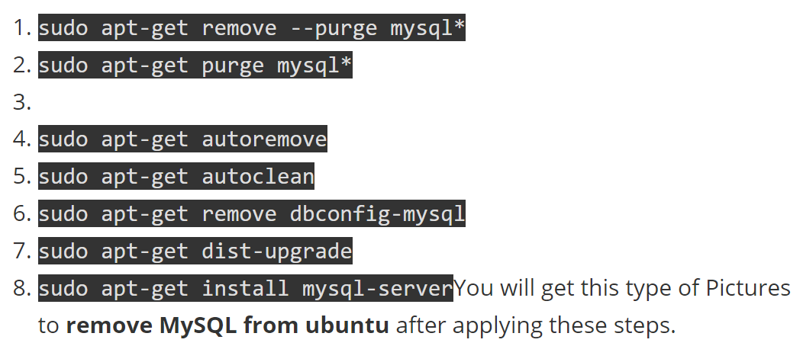

# API_and_Docs

# Oracle
* https://docs.oracle.com/en/java/javase/11/tools/tools-and-command-reference.html

# FrontEnd
* 掘金，前端工具类
>> https://juejin.im/post/5ba7d5dd5188255c6140cc9d#heading-2
* DataTable
>> https://datatables.net/docs/DataTables/1.9.4/DataTable.defaults.columns.html#mData
* W3 Accessible Rich Internet Applications
>> https://www.w3.org/TR/wai-aria/#aria-invalid
* JQuery validator
>> https://jqueryvalidation.org/validate/
* ECMAScript
>> https://tc39.es/ecma262/#sec-promise.resolve
* Datepicker
>> https://api.jqueryui.com/datepicker/
* JQuery API
>> http://hemin.cn/jq/
* button input submit 区别
>> https://harttle.land/2015/08/03/form-submit.html

# Full Stack
* About package.json for NodeJS:
>> https://nodejs.org/en/knowledge/getting-started/npm/what-is-the-file-package-json/

# Spark
* <b>RDD:</b> 
>> 1. RDD API:
>>>> * https://spark.apache.org/docs/2.3.0/api/java/org/apache/spark/rdd/RDD.html
>>>> * https://spark.apache.org/docs/1.1.1/api/python/pyspark.rdd.RDD-class.html#reduceByKey
>> 2. Actions & Transformation:
>>>> * https://spark.apache.org/docs/latest/rdd-programming-guide.html#rdd-operations
* <b>Spark Regular Expression:</b>
>> * https://www.tutorialspoint.com/scala/scala_regular_expressions.htm

* <b>DataFrame</b>
>> 1. DataFrame API:
>>>> * https://spark.apache.org/docs/1.6.3/api/java/org/apache/spark/sql/DataFrame.html
>> 2. SparkSession API:
>>>> * https://spark.apache.org/docs/2.3.0/api/java/org/apache/spark/sql/SparkSession.html

* <b>SparkSQL</b>
>> 1. Spark SQL API:
>>>> * https://spark.apache.org/docs/latest/api/java/org/apache/spark/sql/functions.html
>>>> * https://spark.apache.org/docs/latest/api/sql/index.html

* <b>Spark Machine Learning/Deep Learning</b>
>> 1. NLP:
>>>> * https://nlp.johnsnowlabs.com/docs/en/install

# Hadoop
* https://proquest.safaribooksonline.com/9781449328917

# DB
* Mongo, gitee
>> https://gitee.com/heguangchuan/rainmeter/blob/master/document/mongodb/05-%E6%96%87%E6%A1%A3.md
* Uninstall mysql
>> https://oofloo.com/uninstall-mysql-ubuntu/
 

# OS
* Linux cron
>> https://crontab.guru/
* WSL, Linux subsystem
>> https://docs.microsoft.com/en-us/windows/wsl/install-win10

# Server
* Nginx change default port:
>> https://www.tecmint.com/change-nginx-port-in-linux/#:~:text=In%20Ubuntu%20and%20Debian%20based,shown%20in%20the%20below%20excerpt.

# Tools
* UTC Time
>> https://www.worldtimezone.com/index_cn.php
